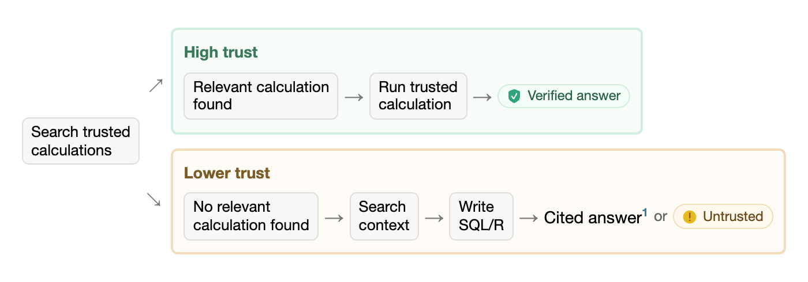

<!-- README.md is generated from README.Rmd. Please edit that file -->

```{r, include = FALSE}
knitr::opts_chunk$set(
  collapse = TRUE,
  comment = "#>",
  fig.path = "man/figures/README-",
  out.width = "100%"
)

library(ggplot2)
```

# commons <a href="https://posit-dev.github.io/commons/"></a>

<!-- badges: start -->
[](https://lifecycle.r-lib.org/articles/stages.html#experimental)
<!-- badges: end -->

> This package is highly experimental.

commons helps data scientists build trustworthy data agents.

Data teams typically have trusted code that they use to analyze their data and build reports and apps. commons leverages their expertise, situating that information in a series of prompts and tools designed to create an accurate, fast, and cost-effective agent.

Trusted calculations can come from R code (as _measures_), [data-dictionary definitions](https://data-dict.tidyverse.org/), Snowflake semantic views, or Databricks metric views.

```{r}
#| echo: false
#| fig-alt: "A screencast demonstrating a commons data agent answering questions with a trusted calculation and then a direct data query. In the first case, there's a provenance pill that marks the answer as verified. In the second case, the pill reads 'Untrusted.'"
knitr::include_graphics(
  "https://github.com/user-attachments/assets/67dcf1f2-1496-406a-96cb-50a2e7050eeb"
)
```

## Installation

To install the package, run:

```r
# install.packages("pak")
pak::pak("posit-dev/commons")
```

## Get started

commons uses [ellmer](https://ellmer.tidyverse.org/) to access LLMs, so you will need access to one of ellmer's supported providers.

We recommend building commons agents with the help of the [agent skill](https://agentskills.io/) that ships with the package. The skill helps coding agents build, evaluate, and improve commons agents.

To make the skill available to Posit Assistant or Codex, copy the skill and its references to `.agents/skills`:

```r
skill <- system.file("skills", "commons", package = "commons")
dir.create(".agents/skills", recursive = TRUE, showWarnings = FALSE)
file.copy(skill, ".agents/skills", recursive = TRUE)
```

For Claude Code, copy the skill and its references to `.claude/skills`:

```r
skill <- system.file("skills", "commons", package = "commons")
dir.create(".claude/skills", recursive = TRUE, showWarnings = FALSE)
file.copy(skill, ".claude/skills", recursive = TRUE)
```

The [Introduction to commons](https://posit-dev.github.io/commons/articles/commons.html) vignette also explains the structure of a commons agent and the creation process.

## Trusted answers

There are two provenance paths available to a commons agent: when users ask questions for which there is trusted code, the agent follows the "happy path," running that code and reporting the result. If the user asks a question for which trusted code is not available, the agent writes custom R or SQL code, leaning on additional context provided to the agent.

Answers display provenance according to the analysis path followed, so users can determine how much trust to put in a given answer.

For more information, see the [Introduction to commons](https://posit-dev.github.io/commons/articles/commons.html) vignette.

<!-- Diagram source: Introduction to commons vignette. Update it there, then save the image. https://github.com/posit-dev/commons/blob/a29ac09c39c8edb99f2a9ea0ecc1836e6538bb25/vignettes/commons.Rmd#L76 -->

```{r trust-flow}
#| echo: false
#| fig-alt: "A question first searches trusted calculations. The high-trust path runs a relevant trusted calculation and produces a verified answer. The lower-trust path searches context and writes custom SQL or R, producing either a cited or untrusted answer."


```

## Evaluation

```{r eval-data}
#| include: false

# Placeholder data until the devrel agent data is more easily accessible
eval_questions <- 32
eval_results <- data.frame(
  system = factor(
    c("Claude Code", "commons"),
    levels = c("Claude Code", "commons")
  ),
  `Mean accuracy (%)` = c(83.5, 86.3),
  `Median solver time (seconds)` = c(60.5, 31.0),
  `Total output tokens` = c(439188, 243403),
  row.names = c("Claude Code", "commons"),
  check.names = FALSE
)
```

The [DevRel agent](https://github.com/posit-dev/devrel-agent) is an example commons agent that answers questions about adoption, engagement, and growth across Posit's open-source projects. The DevRel agent repository contains an [evaluation](https://github.com/posit-dev/devrel-agent/tree/main/evals) that compares performance between the commons agent and Claude Code. Both have access to the same underlying data.

In this evaluation, the commons agent had higher mean accuracy (`r sprintf("%.1f%%", eval_results["commons", "Mean accuracy (%)"])` vs. `r sprintf("%.1f%%", eval_results["Claude Code", "Mean accuracy (%)"])`), took less time to answer questions (a median of `r sprintf("%.1f", eval_results["commons", "Median solver time (seconds)"])` vs. `r sprintf("%.1f", eval_results["Claude Code", "Median solver time (seconds)"])` seconds), and used fewer output tokens (`r format(eval_results["commons", "Total output tokens"], big.mark = ",", scientific = FALSE, trim = TRUE)` vs. `r format(eval_results["Claude Code", "Total output tokens"], big.mark = ",", scientific = FALSE, trim = TRUE)` total).

```{r eval-plot}
#| echo: false
#| fig-width: 10
#| fig-height: 4
#| fig-alt: "Three bar charts compare commons with Claude Code. Commons has higher mean accuracy, lower median solver time, and fewer total output tokens."
metric_columns <- c(
  "Mean accuracy (%)",
  "Median solver time (seconds)",
  "Total output tokens"
)
eval_plot <- stack(eval_results[metric_columns])
names(eval_plot) <- c("value", "metric")
eval_plot$system <- rep(
  eval_results$system,
  times = length(metric_columns)
)
accuracy <- eval_plot$metric == "Mean accuracy (%)"
eval_plot$value[accuracy] <- eval_plot$value[accuracy] / 100

eval_plot |>
  ggplot(aes(x = system, y = value, fill = system)) +
  geom_col(width = 0.7) +
  facet_wrap(vars(metric), scales = "free_y") +
  scale_fill_manual(
    values = c("Claude Code" = "grey85", "commons" = "#438EB5"),
    guide = "none"
  ) +
  scale_y_continuous(
    labels = \(x) {
      if (max(x, na.rm = TRUE) <= 1) {
        paste0(x * 100, "%")
      } else {
        format(x, big.mark = ",", scientific = FALSE, trim = TRUE)
      }
    }
  ) +
  labs(
    x = NULL,
    y = NULL,
    caption = paste(
      eval_questions,
      "questions across three epochs. Higher accuracy is better. Lower time and tokens are better."
    ),
    title = "commons was more accurate, faster, and used fewer tokens than Claude Code",
    subtitle = "Results from the DevRel agent evaluation"
  ) +
  theme_minimal()
```

In the evaluation, both harnesses use Claude Sonnet 5 at medium effort. The evaluation runs each of `r eval_questions` questions three times. Questions require either a numeric answer, a table, a nuanced response, or recognition that the available data cannot answer them.
