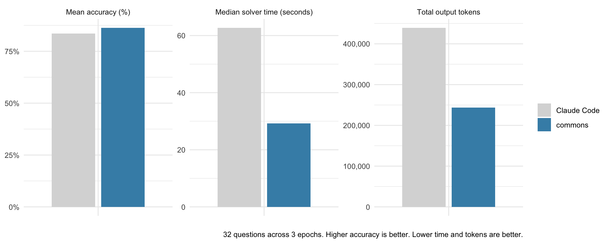

<!-- README.md is generated from README.Rmd. Please edit that file -->

# commons <a href="https://posit-dev.github.io/commons/"></a>

<!-- badges: start -->

[](https://lifecycle.r-lib.org/articles/stages.html#experimental)
<!-- badges: end -->

> This package is highly experimental.

commons helps data scientists build trustworthy data agents. Data teams
typically have trusted code that they use to analyze their data and
build reports and apps. commons gives agents access to that information,
situating it in a series of prompts and tools designed to create an
accurate, fast, and cost-effective agent.


## Installation

To install the package, run:

``` r
# install.packages("pak")
pak::pak("posit-dev/commons")
```

## Trusted answers

There are two provenance paths availabe to a commons agent: when users
ask questions for which there is trusted code, the agent follows the
“happy path,” running that code and reporting the result. If the user
asks a question for which is not trusted code, the agent writes custom R
or SQL code, leaning on additional context provided to the agent.

Answers are tagged according to the analysis path followed, so users can
determine how much trust to put in a given answer.

For more information, see Getting Started.


## Get started

We recommend building commons agents with the help of the [agent
skill](https://agentskills.io/) that ships with the package. The skill
helps coding agents build, evaluate, and improve commons agents.

To make the skill available to **Posit Assistant or Codex**, copy the
skill and its references to `.agents/skills`:

``` r
skill <- system.file("skills", "commons", package = "commons")
dir.create(".agents/skills", recursive = TRUE, showWarnings = FALSE)
file.copy(skill, ".agents/skills", recursive = TRUE)
```

For **Claude Code**, copy the skill and its references to
`.claude/skills`:

``` r
skill <- system.file("skills", "commons", package = "commons")
dir.create(".claude/skills", recursive = TRUE, showWarnings = FALSE)
file.copy(skill, ".claude/skills", recursive = TRUE)
```

## Evaluation

The [DevRel agent](https://github.com/posit-dev/devrel-agent) is a
commons agent that answers questions about adoption, engagement, and
growth across Posit’s open-source projects. The DevRel agent repository
contains an
[evaluation](https://github.com/posit-dev/devrel-agent/tree/main/evals)
that compares performance between the commons agent and Claude Code.
Both have access to the same underlying data.

In this evaluation, the commons agent had higher mean accuracy (86.3%
vs. 83.5%), took less time to answer questions (a median of 29.2
vs. 62.7 seconds), and used fewer output tokens (243,360 vs. 439,200
total).



Both systems use Claude Sonnet 5 at medium effort. The evaluation
includes 32 numeric, table, nuanced, and not-answerable questions, each
run 3 times. A Claude Opus 5 scorer grades numeric and table results
against machine-derived targets and other responses against
question-specific rubrics.
