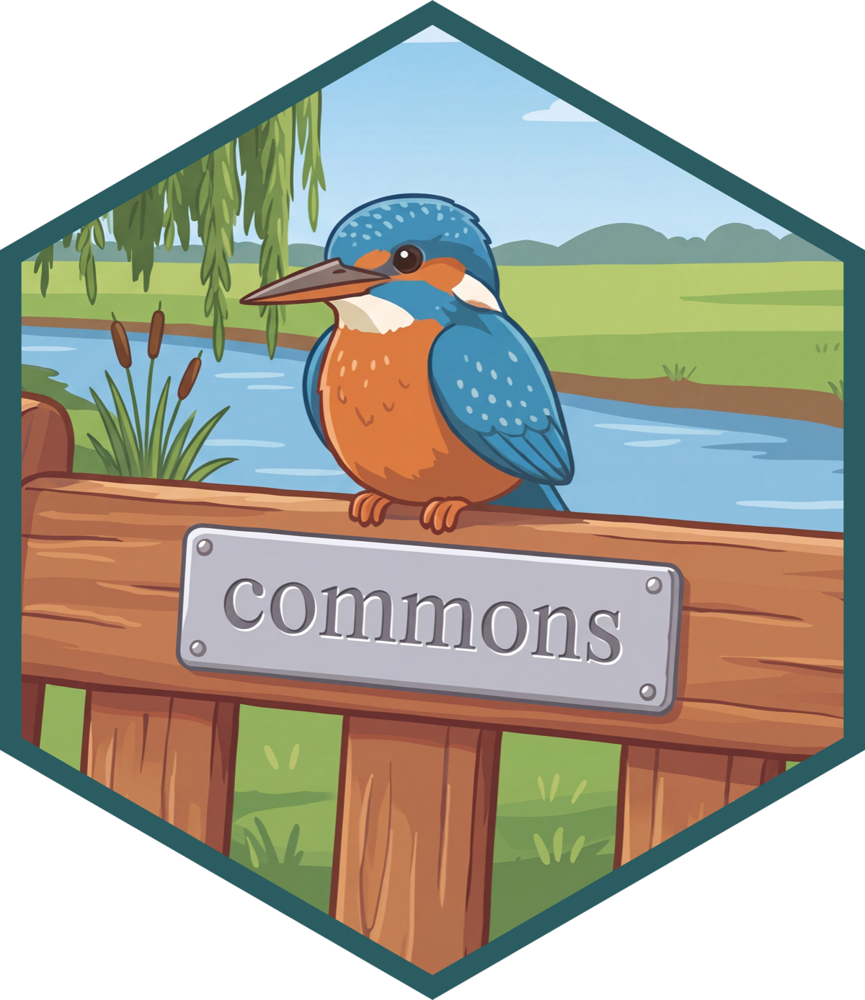

{.hero width="85%" fig-alt="YouTube thumbnail from The Test Set titled \"Your VP Is Doing a Rogue Analysis in Cursor Right Now — with Nell Thomas.\""}

##

::: {.flow}
<div class="fork">
<div class="tier ghost">(High trust)</div>
<div class="arrow oblique up ghost">→</div>
<div class="row ghost"><span class="pill">Call measure</span></div>

<div class="trunk-cell ghost"><span class="pill trunk">Search measures</span></div>
<div></div>
<div></div>

<div class="tier ghost">(Lower trust)</div>
<div class="arrow oblique down ghost">→</div>
<div class="row"><span class="pill low">Search context</span><span class="arrow">→</span><span class="pill low">Write SQL/R</span></div>
</div>
:::

##

::: {.flow}

<div class="fork">
<div class="tier trusted fragment" data-fragment-index="1">(High trust)</div>
<div class="arrow oblique up fragment" data-fragment-index="1">→</div>
<div class="row fragment" data-fragment-index="1"><span class="pill-wrap"><span class="pill high">Call measure</span><span class="tag tag-trusted fragment" data-fragment-index="2">Verified answer</span></span></div>

<div class="trunk-cell fragment" data-fragment-index="1"><span class="pill trunk">Search measures</span></div>
<div></div>
<div></div>

<div class="tier caution fragment" data-fragment-index="1">(Lower trust)</div>
<div class="arrow oblique down fragment" data-fragment-index="1">→</div>
<div class="row"><span class="pill low">Search context</span><span class="arrow">→</span><span class="pill-wrap"><span class="pill low">Write SQL/R</span><sup class="citation-ref fragment" data-fragment-index="3">1</sup><span class="citation-action fragment" data-fragment-index="3">+ Cite trusted source</span><span class="tag tag-caution fragment current-visible" data-fragment-index="2">Untrusted</span></span></div>
</div>
:::

```{=html}
<style>
.reveal section img.hero {
  display: block;
  margin-left: auto;
  margin-right: auto;
  border-radius: 12px;
  box-shadow: 0 8px 24px rgba(0, 0, 0, 0.25);
}
.reveal section img.commons-logo {
  margin: 0;
  position: absolute;
  right: 0.25rem;
  top: 0.25rem;
  width: 15rem;
}
.flow {
  display: flex;
  flex-direction: column;
  align-items: flex-start;
  gap: 3.5rem;
  min-height: 60vh;
  justify-content: center;
  padding-left: 1rem;
}
.fork {
  display: grid;
  grid-template-columns: auto auto 1fr;
  align-items: center;
  column-gap: 0.8rem;
  row-gap: 1.4rem;
}
.tier { font-style: italic; }
.tier.trusted { color: #6fae8c; }
.tier.caution { color: #bd9a5e; }
.trunk-cell { justify-self: start; }
.row { display: flex; align-items: center; gap: 0.8rem; }
.arrow { color: #999; font-size: 1.2em; }
.arrow.oblique { display: inline-block; justify-self: center; }
.arrow.up { transform: translateX(0.6rem) rotate(-30deg); }
.arrow.down { transform: translateX(0.6rem) rotate(30deg); }
.pill {
  display: inline-block;
  padding: 0.4rem 1rem;
  border-radius: 8px;
  border: 1px solid #e0e0e0;
  background: #f2f2f2;
  font-size: 0.85em;
  white-space: nowrap;
}
.pill-wrap { position: relative; display: inline-block; }
.citation-action { color: #397f91; display: block; font-size: 0.65em; margin-top: 0.2rem; text-align: center; }
.citation-action.fragment:not(.visible), .citation-ref.fragment:not(.visible) { display: none; }
.citation-ref.fragment.visible { display: block; }
.citation-ref { color: #397f91; font-size: 0.7em; font-weight: 600; position: absolute; right: 0; top: 0; transform: translate(45%, -40%); }
.ghost { visibility: hidden; }
.tag {
  position: absolute;
  top: 0;
  right: 0;
  transform: translate(55%, -95%);
  display: inline-flex;
  align-items: center;
  gap: 0.25rem;
  border-radius: 999px;
  font-size: 0.42em;
  line-height: 1.2;
  padding: 0.15rem 0.5rem;
  white-space: nowrap;
}
.tag-icon { height: 0.95em; width: 0.95em; margin: 0; vertical-align: baseline; }
.tag-trusted { background: #f2fbf5; border: 1px solid #cfeedd; color: #286144; }
.tag-caution { background: #fff8ec; border: 1px solid #f2ddbb; color: #6b4b1b; }
</style>
```

##

## commons does 3 things

:::incremental
* Extract trusted calculations from existing artifacts into a data structure
* A harness to give the right context at the right time
* A feedback loop to push more queries up the trust ladder over time
:::
