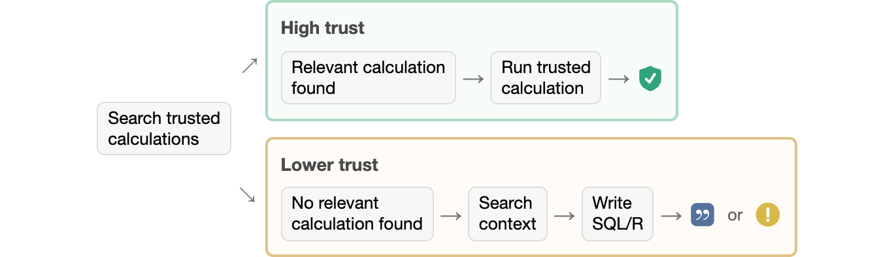
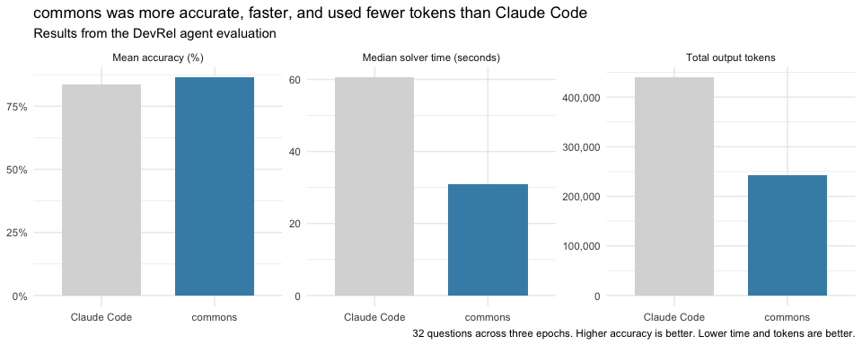

<!-- README.md is generated from README.Rmd. Please edit that file -->

# commons <a href="https://posit-dev.github.io/commons/"></a>

<!-- badges: start -->

[](https://lifecycle.r-lib.org/articles/stages.html#experimental)
<!-- badges: end -->

> This package is highly experimental.

commons helps data scientists build trustworthy data agents.

Data teams typically have trusted code that they use to analyze their
data and build reports and apps. commons leverages their expertise,
situating that information in a series of prompts and tools designed to
create an accurate, fast, and cost-effective agent.

Trusted calculations can come from R code (as *measures*), [data
dictionary](https://data-dict.tidyverse.org/) definitions, Snowflake
semantic views, or Databricks metric views.


## Installation

To install the package, run:

``` r
# install.packages("pak")
pak::pak("posit-dev/commons/pkg-r")
```

## Get started

commons uses [ellmer](https://ellmer.tidyverse.org/) to access LLMs, so
you will need access to one of ellmer’s supported providers.

We recommend building commons agents with the help of the [agent
skill](https://agentskills.io/) that ships with the package. The skill
helps coding agents build, evaluate, and improve commons agents.

To make the skill available to Posit Assistant or Codex, copy the skill
and its references to `.agents/skills`:

``` r
skill <- system.file("skills", "commons", package = "commons")
dir.create(".agents/skills", recursive = TRUE, showWarnings = FALSE)
file.copy(skill, ".agents/skills", recursive = TRUE)
```

For Claude Code, copy the skill and its references to `.claude/skills`:

``` r
skill <- system.file("skills", "commons", package = "commons")
dir.create(".claude/skills", recursive = TRUE, showWarnings = FALSE)
file.copy(skill, ".claude/skills", recursive = TRUE)
```

The [Introduction to
commons](https://posit-dev.github.io/commons/articles/commons.html)
vignette also explains the structure of a commons agent and the creation
process.

## Trusted answers

There are two provenance paths available to a commons agent: when users
ask questions for which there is trusted code, the agent follows the
“happy path,” running that code and reporting the result. If the user
asks a question for which trusted code is not available, the agent
writes custom R or SQL code, leaning on additional context provided to
the agent.

Answers display provenance according to the analysis path followed, so
users can determine how much trust to put in a given answer.

For more information, see the [Introduction to
commons](https://posit-dev.github.io/commons/articles/commons.html)
vignette.

<!-- Diagram source: Introduction to commons vignette. Update it there, then save the image. https://github.com/posit-dev/commons/blob/a29ac09c39c8edb99f2a9ea0ecc1836e6538bb25/vignettes/commons.Rmd#L76 -->



## Evaluation

The [DevRel agent](https://github.com/posit-dev/devrel-agent) is an
example commons agent that answers questions about adoption, engagement,
and growth across Posit’s open-source projects. The DevRel agent
repository contains an
[evaluation](https://github.com/posit-dev/devrel-agent/tree/main/evals)
that compares performance between the commons agent and Claude Code.
Both have access to the same underlying data.

In this evaluation, the commons agent had higher mean accuracy (86.3%
vs. 83.5%), took less time to answer questions (a median of 31.0
vs. 60.5 seconds), and used fewer output tokens (243,403 vs. 439,188
total).



In the evaluation, both harnesses use Claude Sonnet 5 at medium effort.
The evaluation runs each of 32 questions three times. Questions require
either a numeric answer, a table, a nuanced response, or recognition
that the available data cannot answer them.
